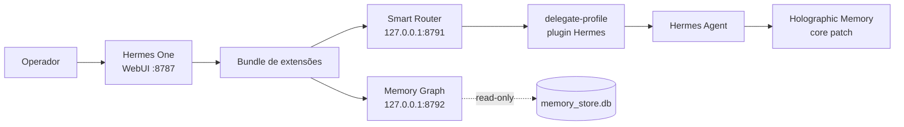

# Manifesto de customizações — Hermes Agent e Hermes One

> **Objetivo:** inventário operacional versionável das extensões, patches e
> integrações locais que compõem a instalação de Hermes de Rodrigo.
>
> **Snapshot validado:** 2026-07-27 (America/Sao_Paulo).
>
> Este documento não substitui o estado real da máquina. Antes de uma mudança,
> use os comandos de verificação em [Rotina de reconciliação](#6-rotina-de-reconciliação).
> Ele deliberadamente não contém tokens, chaves, hashes de senha ou IDs privados.

## Convenções de estado

| Estado | Significado |
|---|---|
| **Versionado** | Está no Git do repositório indicado. |
| **Aplicado** | Está instalado/configurado na máquina. |
| **Ativo** | Há processo ou unit systemd saudável usando o artefato. |
| **Pendente de integração** | Existe no disco, mas ainda não está consolidado em um commit publicável. |

## Topologia



## Inventário resumido

| Área | Artefato | Versionado | Aplicado | Ativo | Fonte de verdade |
|---|---|---:|---:|---:|---|
| Core Hermes | Holographic Memory / recall híbrido | sim | sim | sim | `/usr/local/lib/hermes-agent` |
| Plugin Hermes | `delegate-profile` v0.3.0 | parcialmente | sim | sim | `~/.hermes/plugins/delegate-profile` |
| Routing | Smart Router + sidecar | parcialmente | sim | sim | plugin + `router.yaml` |
| Hermes One | labels de custom providers | sim | sim | sim | `/home/rodrigo/hermes-webui` |
| Hermes One | rota e página `/insights` | não | sim | sim | WebUI working tree |
| Extensão One | Hermes Panel System | bundle local | sim | carregado pelo One | `~/hermes-one-extensions` |
| Extensão One | Office 3D | bundle local | sim | carregado pelo One | `~/hermes-one-extensions` |
| Extensão One | Smart Router | plugin + bundle local | sim | sidecar saudável | `~/hermes-one-extensions` |
| Extensão One | Memory Graph | bundle local | sim | sidecar saudável | plugin local + bundle |
| Integração | MCPs e serviços auxiliares | configuração | sim | varia | perfil `rodrigo` |

---

# 1. Hermes Agent: core local

## Instalação e proveniência

| Campo | Valor no snapshot |
|---|---|
| Repositório | `/usr/local/lib/hermes-agent` |
| Fork | `rodrigogs/hermes-agent` |
| Upstream | `NousResearch/hermes-agent` |
| Branch ativa | `fix/memory-recall-2026-07` |
| HEAD observado | `fddae51e` |
| Working tree | limpo |
| Distância de `upstream/main` | 21 commits à frente |

> A distância de `origin/main` pode ser grande porque o fork acumula histórico.
> Não a use como contagem de patches locais recentes.

## Patch: Holographic Memory e recall

**Estado:** versionado, aplicado e em uso pelo perfil `rodrigo`.

O perfil ativo configura `memory.provider: holographic`. As mudanças diretas de
Rodrigo no core são concentradas em `plugins/memory/holographic/` e
`tools/memory_tool.py`.

| Grupo | Commits | Arquivos principais | Efeito operacional |
|---|---|---|---|
| Recuperação por entidade | `e4ed514c3`, `10ffd0fdd` | `retrieval.py`, `store.py` | Melhora recall por nome e preserva resposta do fallback por scan. |
| Integridade e segurança | `deb16d9a9`, `c37ad7a57`, `ee98db854` | `__init__.py`, `store.py` | Fecha bypasses, adiciona health check e detecta índice parcialmente perdido. |
| Vetores e prefetch | `dcbdea9a7`, `7b7811494`, `9ec4df779` | `__init__.py`, testes | Corrige vetores HRR stale e reforça extração/prefetch comportamental. |
| Latência e continuidade | `88cdc01bd`, `292927a10` | `store.py`, `embeddings.py` | Evita bloqueio de turno e impede desabilitação persistente da busca densa após um blip. |
| Busca híbrida | `9f4c085c0` | `retrieval.py`, `embeddings.py` | Combina recuperação densa e lexical com benchmark regressivo. |
| Escala da memória curta | `ad7594451` | `__init__.py`, `tools/memory_tool.py` | Direciona dados volumosos a `fact_store` e trata overflow de memória curta. |

### Validação conhecida

```bash
cd /usr/local/lib/hermes-agent
python3 -m pytest -q \
  tests/plugins/memory/test_holographic_recall_benchmark.py \
  tests/plugins/memory/test_holographic_recall_fixes.py \
  tests/plugins/memory/test_holographic_embedder_health.py
```

Resultado do snapshot: **72 passed**.

### Rollback

**Não faça `git reset --hard` no core como resposta padrão.** O fork contém
outros commits carregados. Isole primeiro o commit/arquivo alvo:

```bash
cd /usr/local/lib/hermes-agent

git status --short
git log --oneline upstream/main..HEAD -- plugins/memory/holographic tools/memory_tool.py
# Revisar o diff antes de qualquer reversão.
git show <commit>
```

Para reverter um único patch já commitado, use `git revert <commit>` em branch
separada e rode a suíte acima. Para voltar à versão upstream, crie antes um
backup/branch explícito; essa operação é destrutiva para patches locais.

---

# 2. Plugin Hermes: `delegate-profile`

## Papel

`delegate-profile` cria uma fronteira de processo para delegação entre perfis.
A tool `delegate_profile` chama um processo equivalente a:

```text
hermes -p <profile> chat -q <goal>
```

Isso é distinto de `delegate_task(profile=...)`, que é in-process.

| Campo | Valor |
|---|---|
| Instalação efetiva | `/home/rodrigo/.hermes/plugins/delegate-profile` |
| Plugin | `delegate-profile` v`0.3.0` |
| Tool | `delegate_profile` |
| Hook | `post_tool_call` (advisório para uso de profile na tool in-process) |
| Plugin loader | habilitado no perfil `rodrigo` |
| Repositório público | `rodrigogs/hermes-delegate-profile` |

## Smart Router embutido

O plugin também hospeda o Router, que escolhe profile/model/provider quando a
delegação recebe `profile=auto` ou não recebe profile explícito.

| Capacidade | Implementação |
|---|---|
| Regras Stage 0 | `router/rules.py`, `router.yaml` |
| Classificação Stage 1 | `router/classify.py` via LLM configurado |
| Fallback entre rails | `router/adapter.py` e config de tiers/fallbacks |
| Blocklist e breaker | `router/blocklist.py`, `router/breaker.py` |
| Log de decisão | `router/decision_log.py`, `router/durable_decision_log.py` |
| Integração com tool | `__init__.py` |
| HTTP sidecar | `router/one_sidecar.py` |
| Console One | `webui_extension/hermes-smart-router/` |

### Sidecar do Router

| Campo | Valor |
|---|---|
| Unit | `hermes-router-sidecar.service` |
| Bind | `127.0.0.1:8791` |
| Health | `GET /health` |
| Isolamento | loopback-only; `token-v1` no proxy de extensões |
| Config | `~/.hermes/plugins/delegate-profile/router.yaml` |
| Source da unit | `systemd/hermes-router-sidecar.service` |

Verificação:

```bash
systemctl --user status hermes-router-sidecar.service --no-pager
curl -fsS http://127.0.0.1:8791/health
```

Resultado esperado:

```json
{"ok": true, "service": "hermes-smart-router", "version": 1, "token": "present"}
```

`token` é o estado do token-v1 (`present`/`missing`), lido da mesma fonte que a
autenticação usa. `/health` responde 200 nos dois casos de propósito: é o probe do
proxy e a rota que serve o console deste mesmo processo — um 503 derrubaria a
explicação junto com o problema. `missing` com rotas autenticadas respondendo 503
foi o incidente de 2026-08-26 (unit com `HERMES_HOME` de perfil de agente).

### Instalação no Hermes One

O instalador é idempotente e copia — nunca faz symlink — os assets para o
bundle aceito pelo WebUI:

```bash
cd /home/rodrigo/.hermes/plugins/delegate-profile
python3 scripts/install_hermes_one_router.py \
  --extension-root ~/hermes-one-extensions \
  --systemd-dir ~/.config/systemd/user
```

Após instalar, a aprovação da extensão em **Settings → Extensions** é manual.
Essa aprovação é o controle que autoriza o proxy `token-v1` para o sidecar.

### Validação conhecida

```bash
cd /home/rodrigo/.hermes/plugins/delegate-profile
python3 -m pytest -q --disable-warnings --maxfail=1
```

Resultado do snapshot: **424 passed, 2 skipped**.

### Dívida de integração

No snapshot, a cópia instalada contém alterações substanciais ainda não
consolidadas:

- 10 arquivos rastreados modificados;
- 51 arquivos não rastreados;
- Router, sidecar, installer, unit, console, testes e documentação estão nesse
  conjunto;
- o checkout local estava 47 commits atrás e 1 commit à frente de `origin/main`.

**Regra:** antes de atualizar o plugin ou reconstruir a máquina, primeiro
consolide a árvore em commits revisáveis e faça push. Atualizar/reinstalar sem
isso pode descartar o Router efetivo.

### Rollback do Router

1. Preserve evidência e pare apenas o sidecar:

   ```bash
   systemctl --user status hermes-router-sidecar.service --no-pager
   systemctl --user stop hermes-router-sidecar.service
   ```

2. Remova **somente** a entrada `hermes-smart-router` de
   `~/hermes-one-extensions/extensions.json` e o diretório correspondente do
   bundle; não remova `hermes-one-extension-kit`, `hermes-one-fact-explorer` ou `hermes-one-office-3d`.
3. Recarregue/reinicie o serviço WebUI fora de uma conversa que dependa dele.
4. Para reativar, restaure os assets pelo instalador e então execute:

   ```bash
   systemctl --user daemon-reload
   systemctl --user enable --now hermes-router-sidecar.service
   curl -fsS http://127.0.0.1:8791/health
   ```

---

# 3. Hermes One

## Runtime e proveniência

| Campo | Valor no snapshot |
|---|---|
| Repositório | `/home/rodrigo/hermes-webui` |
| Upstream | `nesquena/hermes-webui` |
| Branch | `local/hermes-one-exp-v0.52.141` |
| Serviço | `hermes-webui.service` |
| Processo | `python3 -u server.py` |
| Bind | `127.0.0.1:8787` |

## Patch versionado: labels de custom providers

| Campo | Valor |
|---|---|
| Commit | `b62e245a` |
| Título | `fix(picker): honor config labels for custom_providers + fix @custom label derivation` |
| Efeito | O model picker exibe os labels definidos para `custom_providers` e deriva corretamente labels `@custom`. |

Validação mínima:

```bash
cd /home/rodrigo/hermes-webui
git show --stat b62e245a
git status --short
```

## Patch pendente de integração: Insights

| Campo | Valor |
|---|---|
| Arquivo rastreado | `api/routes.py` |
| Arquivo não rastreado | `webui_extension/insights.html` |
| Rota | `GET /insights` |
| Dados | página estática que consulta `/api/insights` |
| Autenticação | a rota passa pelo gate normal do WebUI; sem sessão pode retornar `302` |

A alteração serve uma UI **Hermes One — Provider Quotas & Insights**. Ela está
carregada pelo serviço se a data de início do processo for posterior ao mtime do
arquivo; isso não substitui um teste de navegador autenticado.

### Rollback de Insights

Como é um patch local não commitado:

```bash
cd /home/rodrigo/hermes-webui
# Primeiro faça cópia ou commit da alteração se quiser preservá-la.
git diff -- api/routes.py
# Só após revisão explícita:
git restore api/routes.py
rm -rf webui_extension
```

> `rm -rf webui_extension` só é seguro se `insights.html` for o único asset
> desejado nesse diretório. Confirme com `git status --short` antes. Depois,
> reinicie o One fora de uma sessão ativa e valide `/api/health/agent`.

---

# 4. Bundle de extensões do Hermes One

## Manifesto carregável

```text
/home/rodrigo/hermes-one-extensions/extensions.json
```

| ID | Objetivo | Fonte/asset | Sidecar |
|---|---|---|---|
| `hermes-one-extension-kit` | Sistema comum de navegação, painel e ponte de temas. | `hermes-panel/` | não |
| `hermes-one-office-3d` | Abre Office 3D no painel central sem abandonar a shell. | `hermes-one-office-3d/` | não |
| `hermes-smart-router` | Console operacional do Router. | `hermes-smart-router/` | `127.0.0.1:8791` |
| `hermes-one-fact-explorer` | Lista de fatos read-only; grafo como segundo modo. | `hermes-one-fact-explorer/` | `127.0.0.1:8792` |

## Hermes Panel System

**Estado:** aplicado no bundle.

Ele padroniza navegação, montagem no rail/sidebar, comportamento mobile e
herança das skins do One. As extensões não devem criar sua própria shell ou
cores fixas; devem usar esse mecanismo.

## Office 3D

**Estado:** aplicado no bundle.

O launcher monta o Office em iframe no painel central. O objetivo é manter
rail, sidebar e sessão atual em vez de fazer `window.location.assign('/office')`
e abandonar o One.

## Smart Router extension

**Estado:** aplicada; depende do sidecar saudável e da aprovação de proxy
`token-v1` em Settings → Extensions.

Manifesto:

```json
{
  "id": "hermes-smart-router",
  "sidecar": {
    "origin": "http://127.0.0.1:8791",
    "health_path": "/health",
    "proxy_auth": "token-v1"
  }
}
```

## Memory Graph extension e sidecar

| Campo | Valor |
|---|---|
| Fonte | `/home/rodrigo/.hermes/plugins/hermes-one-fact-explorer` |
| Unit | `hermes-memory-sidecar.service` |
| Bind | `127.0.0.1:8792` |
| Fonte observada | `~/.hermes/profiles/rodrigo/memory_store.db` |
| Garantia | o sidecar é read-only |

Verificação:

```bash
systemctl --user status hermes-memory-sidecar.service --no-pager
curl -fsS http://127.0.0.1:8792/health
```

Resultado esperado:

```json
{"ok": true, "store": ".../memory_store.db", "present": true}
```

### Rollback de uma extensão do bundle

1. Faça backup do manifesto:

   ```bash
   cp ~/hermes-one-extensions/extensions.json \
      ~/hermes-one-extensions/extensions.json.bak-$(date +%Y%m%d-%H%M%S)
   ```

2. Remova apenas o objeto com o `id` desejado de `extensions.json`.
3. Mova o diretório correspondente para uma área de backup; não apague antes de
   confirmar que o One iniciou sem ele.
4. Se houver sidecar, pare/desabilite **somente** a unit correspondente.
5. Recarregue o One e confirme que os demais IDs continuam no manifesto.

---

# 5. Configurações e integrações relevantes

## Plugins habilitados do perfil `rodrigo`

| Plugin | Estado | Observação |
|---|---:|---|
| `delegate-profile` | habilitado | Plugin local; hospeda a tool e o Router. |
| `disk-cleanup` | habilitado | Bundled. Não é patch local. |
| `security-guidance` | habilitado | Bundled. Não é patch local. |

## MCPs observados

| MCP | Estado no snapshot | Papel |
|---|---:|---|
| `context7` | habilitado | Documentação atualizada. |
| `github` | habilitado | Oito tools selecionadas. |
| `serena` | habilitado | Navegação/edição semântica de código. |
| `playwright` | habilitado | Browser automation via Patchright. |
| `claude-code-mac` | habilitado | Bridge SSH para Mac. |
| `platformio-mcp` | desabilitado | Tooling de firmware. |
| `espressif-docs` | desabilitado | Documentação Espressif. |

### Decisão pendente: `claude-code-mac`

O design do bridge recomenda uso on-demand para evitar loops e processos SSH
ociosos. O snapshot encontrou `claude-code-mac` habilitado no startup e
watchdogs ativos. Não trate isso como defeito automático: é uma decisão
operacional que deve ser confirmada antes de alterar a configuração.

---

# 6. Rotina de reconciliação

Execute estes comandos antes de atualizar Hermes, reinstalar o plugin ou editar
as extensões do One.

```bash
# Core Hermes
cd /usr/local/lib/hermes-agent
git status --short
git branch --show-current
git rev-list --left-right --count upstream/main...HEAD

# Plugin e Router
cd /home/rodrigo/.hermes/plugins/delegate-profile
git status --short
python3 -m pytest -q --disable-warnings --maxfail=1
systemctl --user is-active hermes-router-sidecar.service
curl -fsS http://127.0.0.1:8791/health

# Hermes One e bundle
cd /home/rodrigo/hermes-webui
git status --short
systemctl --user is-active hermes-webui.service
python3 -m json.tool ~/hermes-one-extensions/extensions.json

# Memory Graph
systemctl --user is-active hermes-memory-sidecar.service
curl -fsS http://127.0.0.1:8792/health
```

Critérios de saúde:

- todos os JSONs de health retornam `ok: true`;
- as units requeridas retornam `active`;
- a suíte do plugin passa;
- o core Hermes não possui mudanças não explicadas;
- o manifesto de extensões continua com os IDs esperados;
- alterações pendentes são classificadas como intencionais, commitadas ou
  copiadas para backup antes de qualquer update.

## Atualização transacional automática

**Não use `hermes update` diretamente neste host.** Ele atualiza o core contra
`origin/main` e pode trocar/resetar uma branch local; não conhece os patches de
memória, o Router nem o checkout do One.

O controlador versionado é `scripts/update_hermes_stack.py`. Ele atualiza por
**merge na branch local já ativa**, nunca por `reset --hard` para uma ref
remota:

| Componente | Branch preservada | Ref de entrada |
|---|---|---|
| Core Hermes | `fix/memory-recall-2026-07` | `upstream/main` |
| `delegate-profile` / Router | `main` local | `origin/main` |
| Hermes One | `local/hermes-one-exp-v0.52.141` | `origin/master` |

Contrato de uma execução `apply`:

1. Adquire lock por usuário; duas execuções não podem concorrer.
2. Cria snapshot privado em `~/.hermes/update-backups/hermes-stack/`, contendo
   bundle Git, patch binário, arquivos não rastreados, bundle de extensões,
   unit do Router e cache de modelos do One.
3. Faz `fetch`, guarda alterações pendentes em stash temporário, executa merge
   e reaplica o stash. Conflito é falha, não uma resolução improvisada.
4. Reinstala somente a extensão `hermes-smart-router`, preservando as extensões
   irmãs; roda regressões da memória, suíte do plugin e compilação Python.
5. Reinicia Router → Memory Graph → Hermes One e exige healthchecks loopback.
6. Qualquer falha restaura fontes e artefatos a partir do snapshot e tenta
   reiniciar os serviços restaurados.

Comandos úteis:

```bash
cd /home/rodrigo/.hermes/plugins/delegate-profile

# Só observa: busca refs e mostra commits/dirty state.
python3 scripts/update_hermes_stack.py plan

# Atualização transacional manual.
python3 scripts/update_hermes_stack.py apply --yes

# Reversão explícita de um snapshot listado em ~/.hermes/update-backups/hermes-stack.
python3 scripts/update_hermes_stack.py rollback <snapshot-id> --yes
```

O instalador `scripts/install_hermes_stack_updater.py --enable` copia o
controlador para o plugin efetivo e instala `hermes-stack-update.timer`. O
timer roda aos sábados às 04:15 com atraso aleatório máximo de 30 minutos e
`Persistent=true`; ele apenas chama `apply --yes`, portanto herda o mesmo lock,
snapshot, rollback e validações. Logs ficam no journal:

```bash
systemctl --user list-timers hermes-stack-update.timer
journalctl --user -u hermes-stack-update.service --since '7 days ago' --no-pager
```

A execução pode parar com rollback quando houver conflito de patch. Isso é
comportamento correto: publique/reconcilie o conflito a partir do snapshot em
vez de deixar um serviço rodando com árvore parcialmente atualizada.

## Donos e fronteiras

| Domínio | Repositório/raiz | Não editar sem motivo |
|---|---|---|
| Core Hermes | `/usr/local/lib/hermes-agent` | não misturar com assets One. |
| Plugin/Router | `~/.hermes/plugins/delegate-profile` | não fazer update antes de commit/push. |
| One | `/home/rodrigo/hermes-webui` | não apagar `webui_extension/` sem inventário. |
| Bundle One | `~/hermes-one-extensions` | não remover extensões não relacionadas. |
| Estado do perfil | `~/.hermes/profiles/rodrigo` | nunca versionar segredos/config inteira. |

---

# 7. Evidência do snapshot

| Evidência | Resultado |
|---|---|
| Versão Hermes | `Hermes Agent v0.19.0 (2026.7.20)` |
| Core memory suite | `72 passed` |
| Plugin/router suite | `424 passed, 2 skipped` |
| Router health | `{"ok": true, "service": "hermes-one-capability-router", "version": 1, "token": "present"}` (id na época do snapshot; hoje `hermes-smart-router`) |
| Memory health | `{"ok": true, "store": "…/memory_store.db", "present": true}` |
| Router unit | `active (running)` |
| Memory unit | `active (running)` |
| One unit | `active (running)` |

## Alterações esperadas deste documento

A atualização deste manifesto deve acompanhar qualquer mudança que altere:

- a lista de extensões em `extensions.json`;
- units sidecar ou suas portas;
- commits de patch no core;
- perfil/plugin habilitado;
- integração MCP que seja parte do runtime normal;
- procedimento de validação ou rollback.
